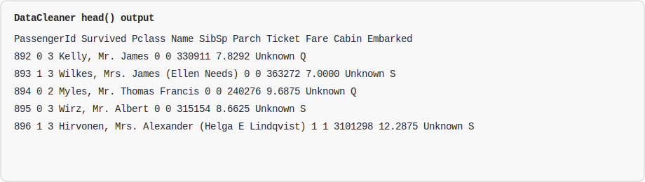
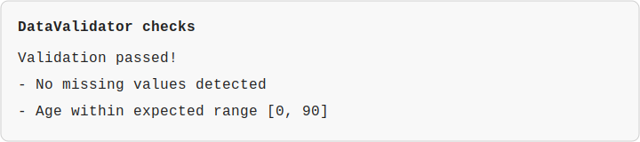
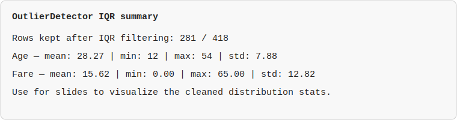

# Fixmydata Library: Data Cleaning, Validation, and Outlier Detection

## 1. Leader: Introduction & Overview of Fixmydata
- **Objective:** Introduce the Fixmydata library, its purpose, and its key modules.
- **Why cleaning and validation matter:** Raw datasets often ship with missing values, duplicates, and outliers that skew analysis and models. Reliable preprocessing is essential for sound insights.
- **What Fixmydata provides:** A comprehensive toolkit for preparing data through cleaning, validation, and outlier detection.
- **Core modules:**
  - **`DataCleaner`** — remove duplicates and handle missing values.
  - **`DataValidator`** — enforce completeness and value constraints.
  - **`OutlierDetector`** — flag and filter outliers via Z-score and IQR methods.


```python
from fixmydata import DataCleaner, DataValidator, OutlierDetector
from fixmydata.utils import load_csv, save_to_csv

df = load_csv("datasets/tested.csv")

# 1) Clean
cleaner = DataCleaner(df)
df_clean = (
    cleaner.remove_duplicates()
           .fill_missing("Age", cleaner.df["Age"].median())
           .fill_missing("Cabin", "Unknown")
           .df
)

# 2) Validate
validator = DataValidator(df_clean)
validator.validate_non_empty()
validator.validate_range("Age", 0, 90)

# 3) Optional: drop outliers
detector = OutlierDetector(df_clean)
df_no_outliers = detector.iqr_outliers(columns=["Fare", "Age"])

save_to_csv(df_no_outliers, "datasets/cleaned.csv")
```

## 2. Member 1: DataCleaner Deep Dive
- **Objective:** Provide an in-depth explanation of the DataCleaner module.
- **Purpose:** Streamline dataset preparation by standardizing how duplicates and missing values are treated.
- **Key functions:**
  - **`remove_duplicates(cols=None)`** — drop redundant rows optionally keyed on specific columns to preserve unique records.
  - **`drop_missing(subset=None)`** — remove rows with missing values (all columns or a subset) to guarantee completeness when imputation is not desired.
  - **`fill_missing(column, value)`** — impute gaps with a supplied statistic or placeholder (e.g., mean, median, domain-specific token).
- **Example workflow:**
  1. Call `remove_duplicates()` to deduplicate a dataframe.
  2. Use `fill_missing('Age', median_age)` to backfill missing ages and `fill_missing('Cabin', 'Unknown')` for categorical placeholders.
  3. Confirm the cleaned dataframe is ready for downstream validation or modeling.
- **Show them the code:**
  ```python
  from fixmydata import DataCleaner

  cleaner = DataCleaner(df)
  df_clean = (
      cleaner.remove_duplicates()
             .fill_missing("Age", cleaner.df["Age"].median())
             .fill_missing("Cabin", "Unknown")
             .df
  )
  print(df_clean.head())
  ```
  
- **Benefit:** Ensures consistent, reproducible cleaning steps so subsequent analyses operate on a trustworthy dataset.

## 3. Member 2: DataValidator Deep Dive
- **Objective:** Explain the DataValidator module and its data validation functionalities.
- **Purpose:** Assert that cleaned data meets basic quality expectations before modeling.
- **Key functions:**
  - **`validate_non_empty()`** — checks that the dataframe is not empty and contains no null values.
  - **`validate_range(column, min_value, max_value)`** — ensures numeric values fall within acceptable bounds (e.g., price within realistic limits).
- **Example workflow:**
  1. Run `validate_non_empty()` after cleaning to guarantee no missing values remain.
  2. Apply `validate_range('Age', 0, 90)` to confirm values stay within domain constraints.
- **Show them the code:**
  ```python
  from fixmydata import DataValidator

  validator = DataValidator(df_clean)
  validator.validate_non_empty()
  validator.validate_range("Age", 0, 90)
  print("Validation passed!")
  ```
  
- **Benefit:** Catches completeness or range issues early, preventing invalid records from contaminating models.

## 4. Member 3: OutlierDetector Deep Dive
- **Objective:** Explain the OutlierDetector module and the methods used for detecting outliers.
- **Purpose:** Identify and filter extreme observations that can distort descriptive statistics and model training.
- **Methods:**
  - **Z-score detection (`z_score_outliers`)** — flags rows whose standardized scores exceed a chosen threshold (default 3 standard deviations from the mean).
  - **Interquartile Range (`iqr_outliers`)** — filters values outside the [Q1 − 1.5×IQR, Q3 + 1.5×IQR] interval, robust to skewed data.
- **Example workflow:**
  1. Use `z_score_outliers(threshold=3)` to drop extreme house prices.
  2. Apply `iqr_outliers()` on columns such as `Age` or `Fare` to keep distributions realistic.
- **Show them the code:**
  ```python
  from fixmydata import OutlierDetector

  detector = OutlierDetector(df_clean)
  df_no_outliers = detector.iqr_outliers(columns=["Fare", "Age"], threshold=1.5)
  print(df_no_outliers.describe())
  ```
  
- **Benefit:** Removes noise so summary statistics and models reflect typical patterns rather than rare extremes.

## 5. Leader/Member 4: Real-World Use Case & Conclusion
- **Objective:** Showcase a practical use case and conclude the presentation.
- **Notebook walkthrough:** The `test/data_cleaning_tutorial.ipynb` demonstrates a full pipeline on bundled datasets.
  - If you need a quick, notebook-free readout of the executed cells, see `docs/data_cleaning_tutorial_results.md`.
  - Load passenger data (`datasets/tested.csv`) and inspect missing values.
  - Clean with `DataCleaner` by filling numeric medians and categorical placeholders, then deduplicate.
  - Validate with `DataValidator` to enforce non-empty data and age ranges.
  - Detect outliers with `OutlierDetector` using IQR for fares, and Z-score for housing price/sqft combinations.
  - Compute quick insights such as the correlation between price and square footage after filtering outliers.
- **Supporting utilities:**
  - **`utils.py`** — convenience helpers (`load_csv`, `save_to_csv`, `check_nulls`) to move data in and out of cleaning pipelines.
  - **`stats.py`** — reusable statistics (`calculate_mean`, `calculate_median`, `correlation`, plus `z_score_outliers` and `iqr_outliers`) to complement cleaning and validation.
- **Benefits of Fixmydata:**
  - **Time-saving:** Automates repetitive preprocessing steps.
  - **Improved data quality:** Produces clean, validated, and outlier-resilient datasets.
  - **Scalability:** Suitable for large datasets with standardized workflows.

Use this outline as a Markdown slide deck or handout to guide a team presentation on Fixmydata.
